# Docker Manager

[](https://openjdk.org/projects/jdk/17/)
[](https://spring.io/projects/spring-boot)
[](https://www.docker.com/)
[](LICENSE)

A REST API that manages the Docker images and containers of the machine it runs on: list images, and create, start, stop and remove containers — the same operations as the `docker` command line, over HTTP.

A study project on how a Java application talks to the Docker Engine: through its API, over the Unix socket, with the [docker-java](https://github.com/docker-java/docker-java) client.

> **Security:** this API has full control of the Docker daemon, which amounts to root access to the host, and it has **no authentication**. That is why it listens on `127.0.0.1` only. Expose it (`SERVER_ADDRESS=0.0.0.0`) only on a network you trust.

## Architecture

<p align="center"><a href="docs/architecture.svg"></a></p>

- **`DockerClientConfig`** builds the `DockerClient` bean: the Engine's address comes from `docker.socket.path`, and requests go through the Apache HttpClient 5 transport.
- **`DockerService`** wraps the `docker-java` commands; the two controllers only translate HTTP into those calls.
- **`DockerExceptionHandler`** turns the Engine's errors into the HTTP status they mean, instead of a 500.

## Tech stack

- **Java 17**
- **Spring Boot 3.4.2** — Spring Web
- **docker-java 3.5.3** — `docker-java-core` with the `httpclient5` transport
- **Maven**, through the Maven Wrapper (`./mvnw`)

## Endpoints

| Method | Path | Response |
|---|---|---|
| `GET` | `/api/images` | All local images |
| `GET` | `/api/images/filter?imageName=alpine` | Images matching a reference: `alpine`, `alpine:3.20`, `postgres:*` |
| `GET` | `/api/containers?showAll=true` | Containers; `showAll=false` lists only the running ones |
| `POST` | `/api/containers?imageName=alpine:3.20` | Creates a container, **201** with `{ "id": "..." }` |
| `POST` | `/api/containers/{id}/start` | Starts it |
| `POST` | `/api/containers/{id}/stop` | Stops it |
| `DELETE` | `/api/containers/{id}` | Removes it |

| Error | Status |
|---|---|
| Unknown container or image | **404** |
| Starting a running container, or stopping a stopped one | **409** |
| Removing a container that is still running | **409** — stop it first |

Creating a container does not pull the image: it must already exist locally. It also takes no command, so the container runs the image's default one — `alpine`, for example, exits as soon as it starts.

```bash
# create, start, stop and remove a container; nginx keeps running once started
docker pull nginx:alpine
ID=$(curl -s -X POST "http://localhost:8080/api/containers?imageName=nginx:alpine" | sed 's/.*"id":"\([^"]*\)".*/\1/')
curl -X POST "http://localhost:8080/api/containers/$ID/start"
curl -X POST "http://localhost:8080/api/containers/$ID/stop"
curl -X DELETE "http://localhost:8080/api/containers/$ID"
```

## Running locally

Requirements: **Java 17** and **Docker**, with your user allowed to use the Docker socket (on Linux, a member of the `docker` group). Maven does not need to be installed.

```bash
git clone https://github.com/nathan00pdl/docker-manager.git
cd docker-manager
./mvnw spring-boot:run
```

The API starts on `http://127.0.0.1:8080`.

### Configuration

| Property | Environment variable | Default |
|---|---|---|
| `docker.socket.path` | `DOCKER_SOCKET_PATH` | `unix:///var/run/docker.sock` |
| `server.address` | `SERVER_ADDRESS` | `127.0.0.1` |

Rootless Docker and Docker Desktop use a different socket; point `DOCKER_SOCKET_PATH` at it (`docker context ls` shows which one).

## Diagrams

Click a diagram to open it at full size. The diagram is generated from the Mermaid source in `docs/`, so it stays editable text rather than a binary image:

```bash
npx @mermaid-js/mermaid-cli -i docs/architecture.mmd -o docs/architecture.svg -t default -b white -c docs/mermaid-config.json
```

## License

Licensed under the [MIT License](LICENSE).

## Contact

Nathan Paiva de Lacerda — [LinkedIn](https://www.linkedin.com/in/nathan-paiva-636336236)
